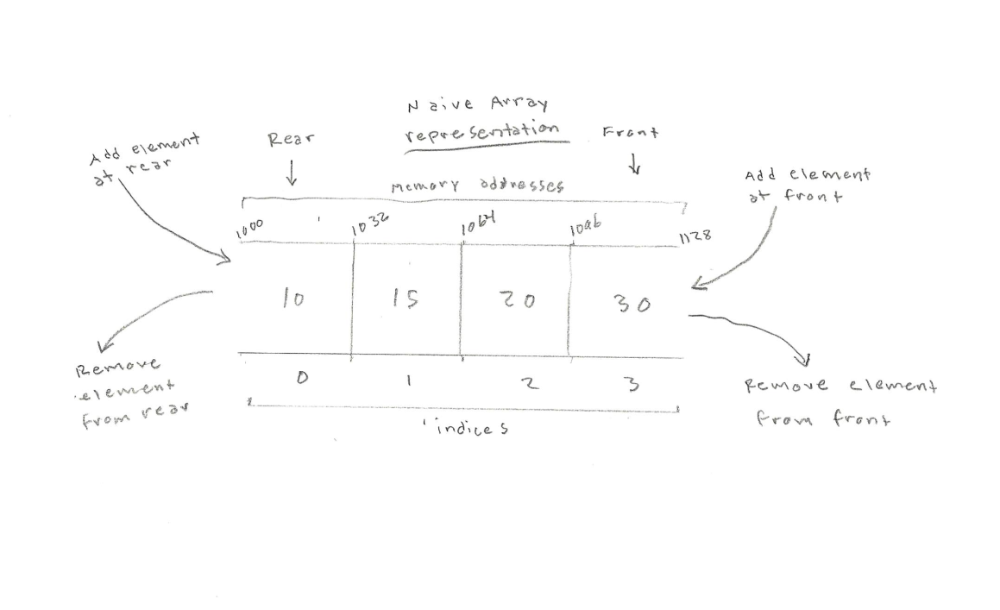

<h1>The Deque Abstract Data Type</h1>

A <strong>deque</strong> (pronounced "deck"), also known as a <strong>double-ended queue</strong>, is an ordered collection of items similar to the queue. It has two ends, a front and a rear, and the items remain positioned in the collection. What makes a deque different is the unrestrictive nature of adding and removing items. New items can be added at either the front or the rear. Likewise, existing items can be removed from either end. Even though the deque assumes many of the characteristics of stacks and queues, it does not require the LIFO and FIFO orderings that are enforced by those data structures.

<h1>In Memory</h1>

In memory, a deque looks like this:

<h1>Common Operations</h1>

<ul>
  <li><strong>Access</strong> - access element using the given index
  <li><strong>Search</strong> - search for an element using given the index or by value
  <li><strong>Insert</strong> - add an element at the given index
  <li><strong>Delete</strong> - delete an element at the given index
</ul>

<h1>Performance</h1>

<ul>
  <li><strong>Accessing/Search Time</strong>: O(n) - to access or find an arbitary element stored in a deque requires shifting its contents repeatedly until it is found. The time complexity of this operation is proportional to the size of the data set and is therefore linear
  <li><strong>Insertion/Deletion Time</strong>: O(1) - inserting or deleting an item into/from a deque, can take place at the front or back of the deque and is therefore done in constant time. Additionally, the time complexity of insertion or deletion in the middle, given an iterator, is O(1)
</ul>

<h1>Use Cases</h1>

<ul>
  <li>Storing a web browser's history
  <li>Storing a software application's list of undo operations
  <li>Priority queueing applications
</ul>

<h1>Example</h1>

&copy; Nathaniel Pierce. All rights reserved.

