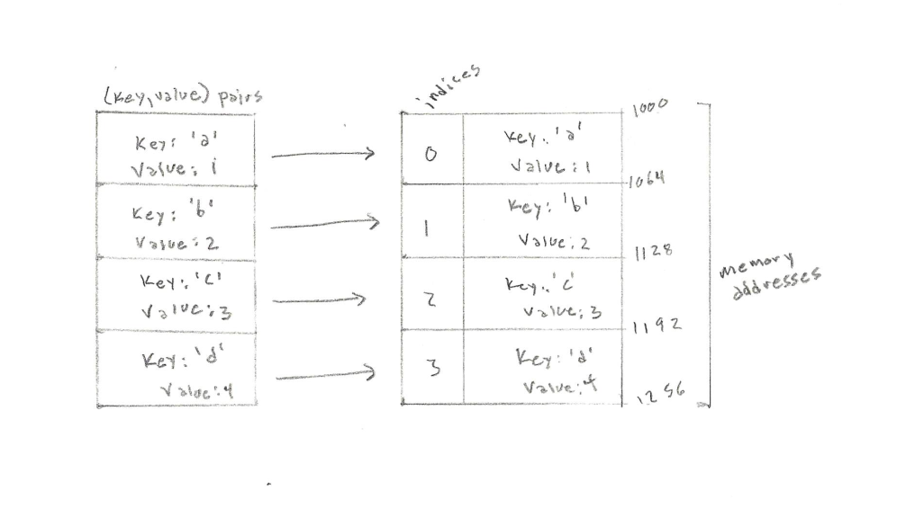

<h1>The Dictionary Abstract Data Type</h1>

A <strong>dictionary</strong> is an abstract data type that stores (key, value) pairs. Dictionaries are sometimes referred to as <strong>associative arrays</strong>, a <strong>hash</strong>, or a <strong>map</strong>. Unlike sequences, which are indexed by a range of numbers, dictionaries are indexed by keys, which can be of any immutable type. Each key appears, at most, once in the collection. Values are accessed by thier assocated keys.

<h1>In Memory</h1>

In memory, a dictionary looks like this:

<h1>Common Operations</h1>

<ul>
  <li><strong>Access</strong> - access element using the given key
  <li><strong>Search</strong> - search for an element using given the key or by value
  <li><strong>Insert</strong> - add a new (key, value) pair to the collection
  <li><strong>Delete</strong> - remove a (key, value) pair to the collection
</ul>

<h1>Performance</h1>

<ul>
  <li><strong>Access</strong> - N/A: in a dictionary there is no notion of order, therefore time complexity of access is not applicable
  <li><strong>Search/Insert/Delete</strong> - O(n): the search, insert, and delete operations of a dictionary can all be executed in constant time. However, the worst case time complexity of these operations are classified as O(n) due to the fact that the time it takes to iterate over a dictionary is proportional to the number of (key, value) pairs.
</ul>

<h1>Use Cases</h1>

<ul>
  <li>you must frequently search for and update elements within a large data set
  <li>you need to find duplicate elements in a data set
  <li>you must quickly store and retrieve elements from a large data set
</ul>

<h1>Example</h1>

&copy; Nathaniel Pierce. All rights reserved.

