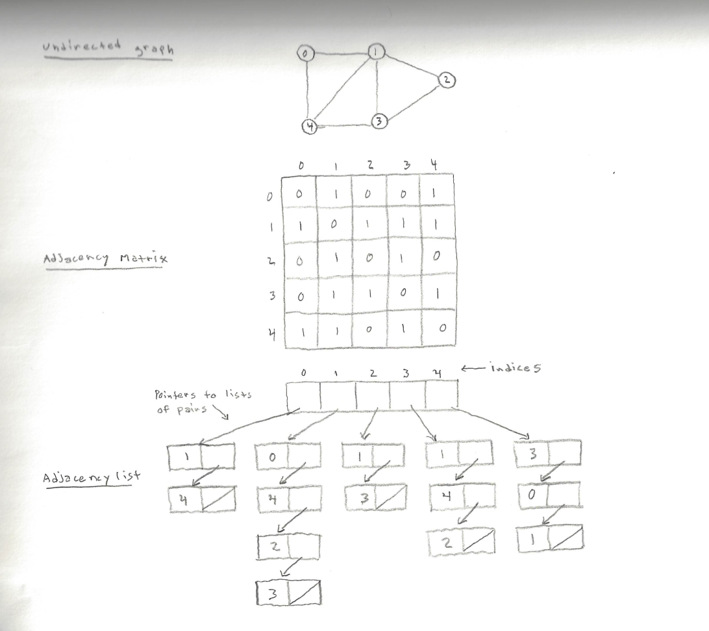

<h1>The Graph Abstract Data Type</h1>

A <strong>graph</strong> graph is a non-linear data structure represented as an ordered pair of a set of <strong>vertices</strong> and a set of <strong>edges</strong>. In a graph, nodes are represented as vertices and the path/s between each node are represented as edges. There are no rules dictating the connection between vertices; vertices can be connected by edges in any way possible. An edge is uniquely identified by its two endpoints. Edges can be directed (the connection is one way), or undirected (the connection is two ways). Directed edges can be represented as ordered pairs and undirected edges can be represented as unordered pairs. Graphs are typically represented by 2-dimensional matrices known as <strong>sparse matrices</strong>, or <strong>adjacency lists</strong>. In a sparse matrix, a graph is represented as a group of cells where each cell represents a vertex and the intersection of each row and column represent the edges between vertices. In an adjacency list, a graph is represented by maintaining a list of all the vertices in the graph and each vertex object in the graph maintains a list of the other vertices that it is connected to. Because of the inefficient use of space in sparse matrices, adjacency lists are far more common.

<h1>In Memory</h1>

In memory, graph looks like this:

<h1>Common Operations</h1>

<ul>
  <li><strong>Search</strong> - check if graph contains given value or check if connection exists between two given vertices
  <li><strong>Insert</strong> - add vertex to graph or create edges between two vertices
  <li><strong>Delete</strong> - remove vertex from graph or remove edge between two vertices 
</ul>

<h1>Performance</h1>

In an adjacency list, the neighbors of each vertex may be listed efficiently, in time proportional to the degree of the vertex. In an adjacency matrix, this operation takes time proportional to the number of vertices in the graph, which may be significantly higher than the degree. On the other hand, the adjacency matrix allows testing whether two vertices are adjacent to each other in constant time; the adjacency list is slower to support this operation.

<ul>
  <li><strong>Insertions</strong> - O(1): The insertion of a node only requires creating a property (fields of object/classes with dedicated getter/setter routines) on an object and is therefore a constant time operation.
  <li><strong>Deletion</strong> - O(n): if a vertex has edges, it is necessary to iterate over all of it’s existing edges to remove it’s existence as an edge on it’s connected vertices. The time complexity of removing an edge depends on its degree, which is a linear operation.
  <li><strong>Search</strong> - O(1): to find a graph property, such as a vertex, is a constant time operation. To check if a connection exists between two edges is also a constant time lookup since both nodes are graph properties.
</ul>

<h1>Use Cases</h1>

<ul>
  <li>representing a social network
  <li>representing maps
  <li>GPS navigation
  <li>airline traffic
  <li>network routing
</ul>

<h1>Example</h1>

&copy; Nathaniel Pierce. All rights reserved.

