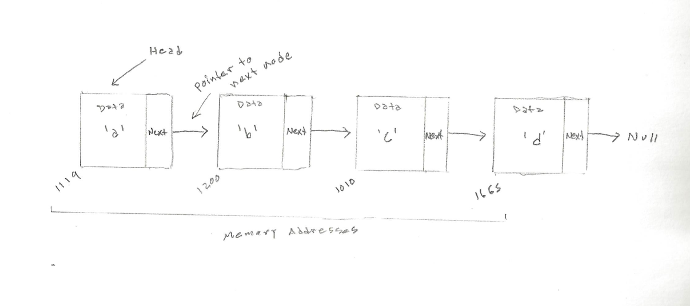

<h1>The List Abstract Data Type</h1>

<p>A <strong>list</strong> or <strong>linked list</strong> is a collection of items where each item holds a relative position with respect to the others. We can consider the list as having a first item, a second item, a third item, and so on. We can also refer to the beginning of the list (the first item) or the end of the list (the last item). A linked list maintains the relative positioning of the items it stores. However, there is no requirement that it maintains that positioning in contiguous memory. Instead, it maintain some explicit information in each item, namely the location of the next item, then the relative position of each item can be expressed by simply following the link from one item to the next.</p>

<h1>In Memory</h1>
<p>In memory, a list looks like this:</p>


<h1>Common Operations</h1>

<ul>
  <li><strong>Access</strong> - access element using the given index
  <li><strong>Search</strong> - search for an element using given the index or by value
  <li><strong>Insert</strong> - add an element at the given index
  <li><strong>Delete</strong> - delete an element at the given index
</ul>

<h1>Performance</h1>

<ul>
  <li><strong>Accessing Time</strong>: O(n) - to access an element stored in a linked list you must traverse the list using the references stored in each node, starting from the head. Accessing time is proportional to the size of the dataset and is therefore linear.
  <li><strong>Search Time</strong>: O(n) - to search for an element stored in a linked list you must traverse the list using the references stored in each node, starting from the head. The number of comparisons made while searching also depends on the size of the dataset and is therefore linear.
  <li><strong>Insertion Time</strong>: O(1) - items stored in a linked list are not stored in contiguous memory. Therefore, if you are at the position where the item must be inserted, insertion can be done in constant time.
  <li><strong>Deletion Time</strong>: O(1) - similarly, if the address of the item previous to the item that must be deleted, deletion from a list can be done in constant time.
</ul>

<h1>Use Cases</h1>

<ul>
  <li> you need constant-time insertions/deletions from the list
  <li> you don't know how many items will be in the list. With arrays, you may need to re-declare and copy memory if the array grows too big
  <li> you don't need random access to any elements
  <li> you want to be able to insert items in the middle of the list
</ul>

<h1>Implementation</h1>

<p>Python implementation of unordered list ADT:</p>

```python

class Node:

    def __init__(self, init_data):
        self.data = init_data
        self.next = None

    def get_data(self):
        return self.data

    def get_next(self):
        return self.next

    def set_data(self, new_data):
        self.data = new_data

    def set_next(self, new_next):
        self.next = new_next

```

```python

from Node import Node


class UnorderedList:

    def __init__(self):
        self.head = None

    def is_empty(self):
        return self.head == None

    def add(self, item):
        temp = Node(item)
        temp.set_next(self.head)
        self.head = temp

    def length(self):
        current = self.head
        count = 0
        while current != None:
            count += 1
            current = current.get_next()
        return count

    def search(self, item):
        current = self.head
        found = False
        while current != None and not found:
            if current.get_data() == item:
                found = True
            else:
                current = current.get_next()
        return found

    def remove(self, item):
        current = self.head
        previous = None
        found = False
        while not found:
            if current.get_data() == item:
                found = True
            else:
                previous = current
                current = current.get_next()
    
        if previous == None:
            self.head = current.get_next()
        else:
            previous.set_next(current.get_next())

```

<h1>Example</h1>


<p>&copy; Nathaniel Pierce. All rights reserved.</p>

