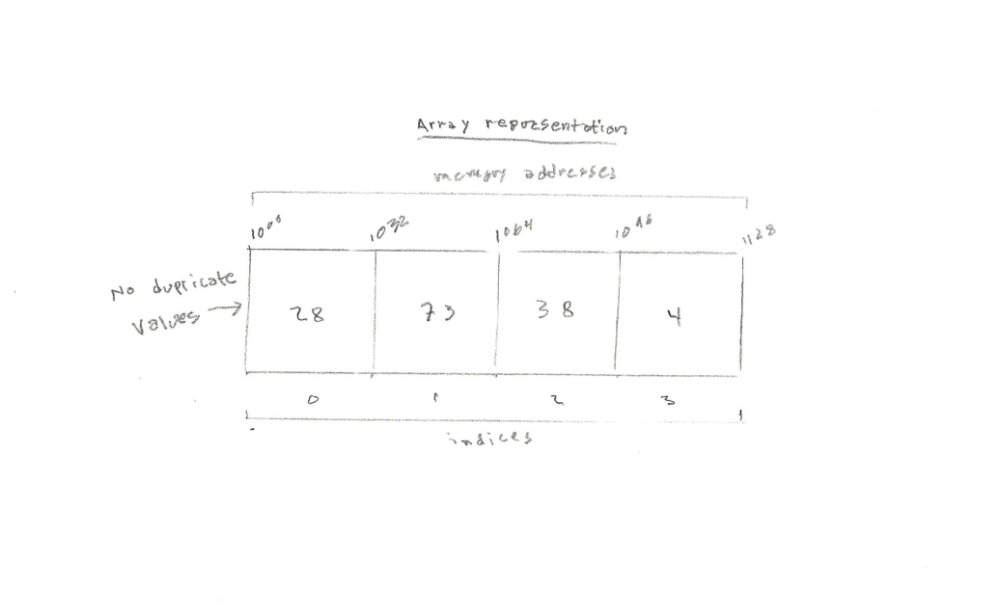

<h1>The Set Abstract Data Type</h1>

A <strong>Set</strong> is an unordered collection with no duplicate elements. Basic uses include membership testing and eliminating duplicate entries. Set objects also support mathematical operations like union, intersection, difference, and symmetric difference. Unlike most other collection types, rather than retrieving a specific element from a set, one typically tests a value for membership in a set. Sets can either be static (unchanging) or dynamic (mutable).

<h1>In Memory</h1>

In memory, a set looks like this:

<h1>Common Operations</h1>

<ul>
  <li><strong>Search</strong> - search for an element using given the index or by value
  <li><strong>Insert</strong> - add an element into a dynamic set at the given index
  <li><strong>Delete</strong> - delete an element from a dynamic set at the given index
  <li><strong>union(A, B)</strong> - returns the union of sets A and B.
  <li><strong>intersection(A, B)</strong> - returns the intersection of sets A and B.
  <li><strong>difference(A, B)</strong> - returns the difference of sets A and B.
  <li><strong>subset(A, B)</strong> - a predicate that tests whether the set A is a subset of set B.
</ul>

<h1>Performance</h1>

<ul>
  <li><strong>Search/Insert/Delete</strong>: O(n) - sets can be implemented using various data structures, which provide different time and space trade-offs for various operations. A Python set is implemented as a <strong>hash table</strong> - a data structure which stores data in an associative manner. In a hash table, data is stored in an array format, where each data value has its own unique index value. Therefore, the search, insert and delete operations are O(n) worst case
  <li><strong>Mathematical Operations</strong>: O(len(a)+len(b)), where a and b are sets 
</ul>

<h1>Use Cases</h1>

<ul>
  <li>you need to perform operations on multiple values at once
  <li>you need to test whether elements belong to set of values
</ul>

<h1>Example</h1>

&copy; Nathaniel Pierce. All rights reserved.

