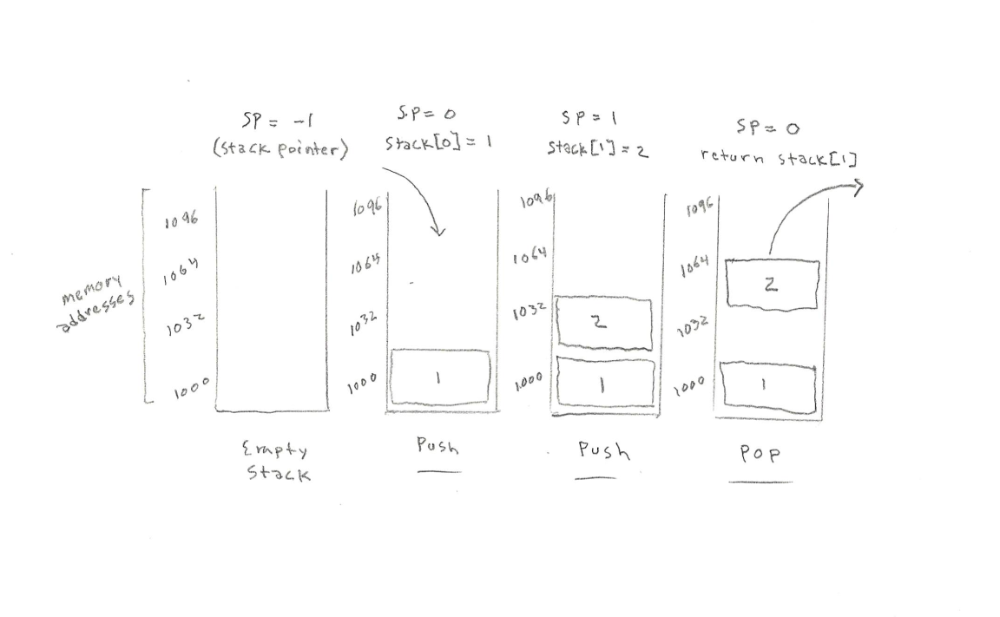

<h1>The Stack Abstract Data Type</h1>

<p>A <strong>stack</strong> is an ordered collection of items where the addition of new items and the removal of existing items always takes place at the same end. The base of the stack is significant since items stored in the stack that are closer to the base represent those that have been in the stack longest. The most recently added item is the one that is in position to be removed first. This ordering principle is sometimes called <strong>LIFO</strong>, last-in first-out. It provides an ordering based on length of time in the collection. Stacks are fundamentally important, as they can be used to reverse the order of items. The order of insertion is the reverse of the order of removal.</p>

<h1>In Memory</h1>
<p>In memory, stack looks like this:</p>



<h1>Common Operations</h1>

<ul>
  <li><strong>Access</strong> - access element using the given index
  <li><strong>Search</strong> - search for an element using given the index or by value
  <li><strong>Insert</strong> - add an element at the given index
  <li><strong>Delete</strong> - delete an element at the given index
</ul>

<h1>Performance</h1>

<ul>
  <li><strong>Accessing Time</strong>: O(n) - accessing element that are not at the top of the stack require all other elements to be shifted. This time complexity of this operation depends on the size of the stack and is therefore a linear operation.
  <li><strong>Search Time</strong>: O(n) - similary, to find an item that is not stored at the top of the stack, all other elements must be shifted. This is a linear operation.
  <li><strong>Insertion/Deletion Time</strong>: O(1) - the insertion or deletion of items in a stack is done at the very top or end of the stack. Because elements in a stack are stored at contiguous locations in memory, this is done in constant time.
</ul>

<h1>Use Cases</h1>

<ul>
  <li>Maintaining function calls
  <li>String reversal
  <li>Balanced parenthesis
  <li>Back functionality in web browsers
</ul>

<h1>Implementation</h1>

<p>Python implementation of stack ADT:</p>

```python

class Stack:

    def __init__(self):
        self.items = []

    def is_empty(self):
        return self.items == []

    def push(self, item):
        self.items.append(item)

    def pop(self):
        return self.items.pop()

    def peek(self):
        return self.items[len(self.items) -1]

    def size(self):
        return len(self.items)

```

<h1>Example</h1>


<p>&copy; Nathaniel Pierce. All rights reserved.</p>
