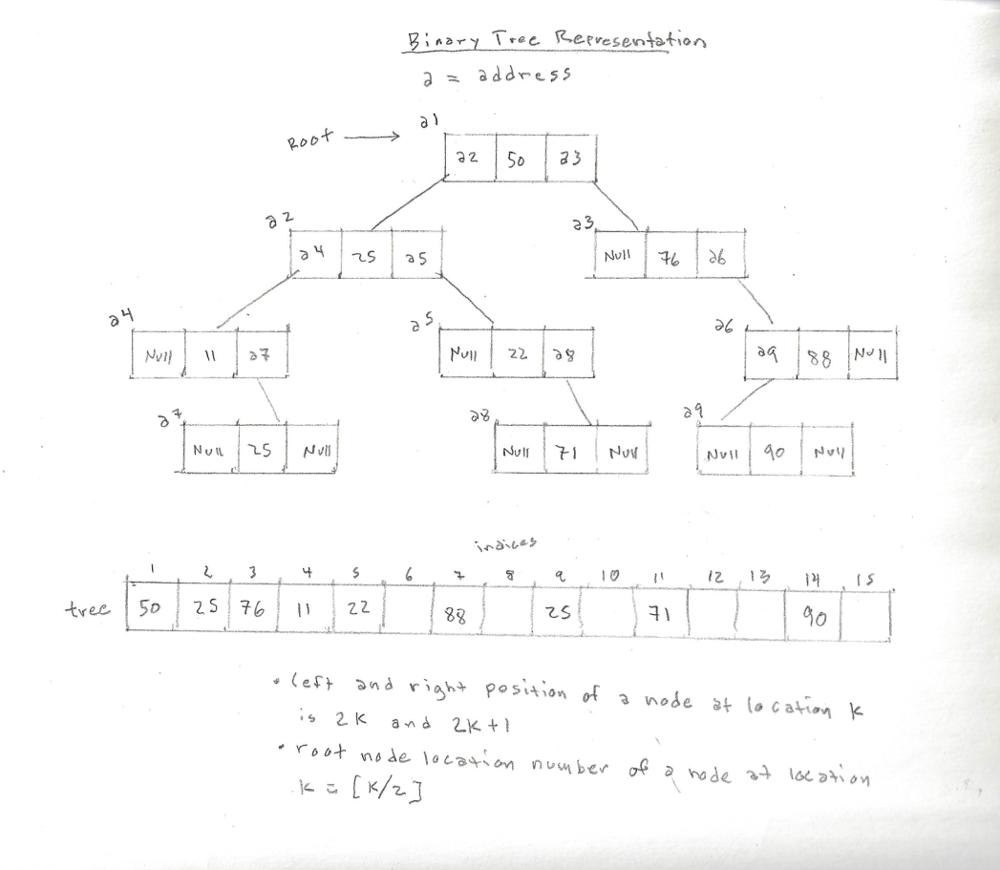

<h1>The Tree Abstract Data Type</h1>

The <strong>tree</strong>, similar to the list, stack and queue, is a linked data structure. Unlike the list, stack and queue, the tree is a nonlinear, hierarchical structure that may contain multiple relationships among its <strong>nodes</strong> (the fundamental unit of which graphs are formed). A tree is a collection of nodes connected by directed (one-way) or undirected (two-way) <strong>edges</strong> (the path between each node). A tree may be empty(no nodes) or may consist of a <strong>root</strong> (a node that has no parent nodes), and zero or more subtrees. There are many different implementations of trees, from general trees to AVL and Red-Black trees, that are all very useful for different reasons.

<h1>In Memory</h1>

In memory, a tree looks like this:

<h1>Common Operations</h1>

<ul>
  <li><strong>Access</strong> - access element using the given node
  <li><strong>Search</strong> - search for an element within a tree given the value
  <li><strong>Insert</strong> - add a new node to the structure
  <li><strong>Delete</strong> - remove a node from the structure
</ul>

<h1>Performance</h1>

<ul>
  
O(log(n)), worst case: O(n) - if a tree is balanced, the complexity of a tree's operations may all be executed in O(log(n)) logarithmic time. However, if a tree is not balanced, the tree can descend into a linked list, in which case the complexity of its operations will be proportional to the size of the dataset.
</ul>

<h1>Use Cases</h1>

<ul>
  <li>you must organize a large data set in an efficient manner
  <li>you need to store information that naturally forms a hierarchical order
  <li>you need to be able to both insert/delete and search in moderate time
</ul>

<h1>Example</h1>

&copy; Nathaniel Pierce. All rights reserved.

